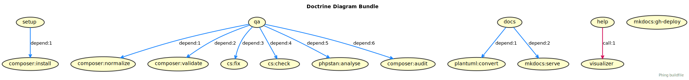

# Doctrine Diagram Bundle

## Usage

@todo

## How to install

@todo

## Requirements

@todo

## Contributing

If you liked this project, ⭐ [star it on GitHub](https://github.com/jawira/doctrine-diagram-bundle).

## License

This library is licensed under the [MIT license](LICENSE.md).

***

## Packages from jawira

<dl>

<dt>
  <a href="https://packagist.org/packages/jawira/case-converter">jawira/case-converter 
  </a>
</dt>
<dd>Convert strings between 13 naming conventions: Snake case, Camel case,
  Pascal case, Kebab case, Ada case, Train case, Cobol case, Macro case,
  Upper case, Lower case, Sentence case, Title case and Dot notation.
</dd>

<dt>
  <a href="https://packagist.org/packages/jawira/emoji-catalog">jawira/emoji-catalog
  </a>
</dt>
<dd>Get access to +3000 emojis as class constants.</dd>

<dt>
  <a href="https://packagist.org/packages/jawira/plantuml">jawira/plantuml
  </a>
</dt>
<dd>Provides PlantUML executable and plantuml.jar</dd>

<dt><a href="https://packagist.org/packages/jawira/">more...</a></dt>
</dl>
