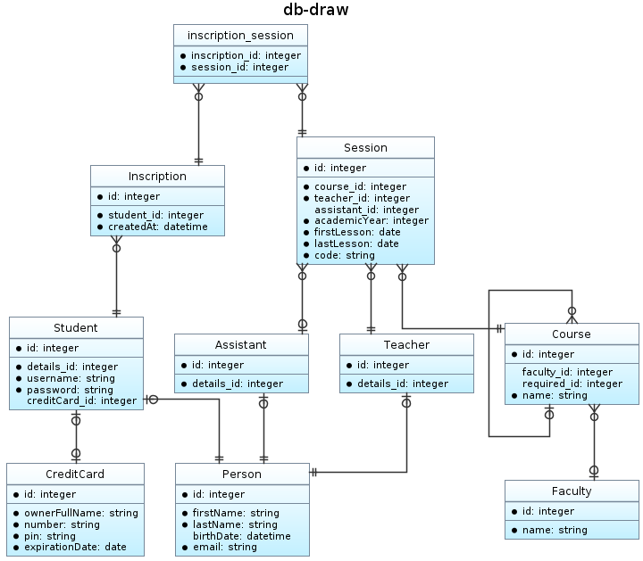

# Doctrine Diagram Bundle

**📐 Symfony Bundle to generate database diagrams.**

[](https://packagist.org/packages/jawira/doctrine-diagram-bundle)
[](https://packagist.org/packages/jawira/doctrine-diagram-bundle)
[](https://packagist.org/packages/jawira/doctrine-diagram-bundle)
[](https://packagist.org/packages/jawira/doctrine-diagram-bundle)

## Installation

```bash
composer config extra.symfony.allow-contrib true
composer require jawira/doctrine-diagram-bundle --dev
```

## Usage

Run this command to generate an _ER_ diagram:

```console
bin/console doctrine:diagram:er
```

Then open `er.svg` located at the root of your project:



## Documentation

<https://jawira.github.io/doctrine-diagram-bundle/>

## Contributing

- Please report any bug.
- If you liked this project, ⭐ star it on GitHub.
- Or follow me on 𝕏. [](https://x.com/jawira)

## License

This library is licensed under the [MIT license](LICENSE.md).

***

## Packages from jawira

<dl>

<dt>
  <a href="https://packagist.org/packages/jawira/plantuml">jawira/plantuml
  </a>
</dt>
<dd>Provides PlantUML executable and plantuml.jar</dd>

<dt><a href="https://packagist.org/packages/jawira/">more...</a></dt>
</dl>
