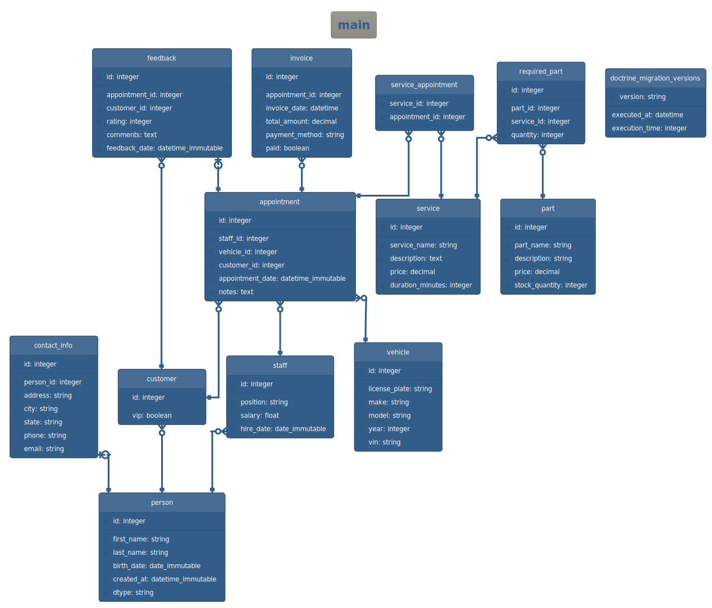
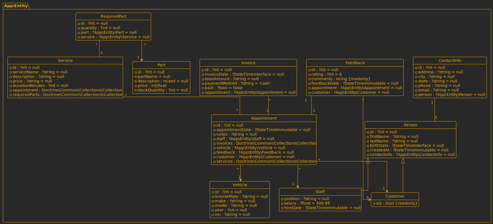

## How to configure the bundle

You have to ways to configure _DoctrineDiagramBundle_.

1. Using a configuration file `config/packages/doctrine_diagram.yaml`.
2. Using command's options.

!!! Info

    Command line options will always have priority over configuration file.

### Command's options

Use `help` command to see available options for `doctrine:diagram:er` and
`doctrine:diagram:class`.

```console
$ bin/console help doctrine:diagram:er
Options:
    --filename=FILENAME      Destination file name.
    --format=FORMAT          Diagram format (svg, png or puml).
    --size=SIZE              Diagram size (mini, midi or maxi).
    --converter=CONVERTER    Which strategy will be used to convert puml to another format (auto, jar or server).
    --server=SERVER          PlantUML server URL, used to convert puml diagrams to svg or png.
    --jar=JAR                Path to plantuml.jar, used to convert puml diagrams to svg or png.
    --connection=CONNECTION  Doctrine connection to use.
    --theme=THEME            Change diagram colors and style.
    --exclude=EXCLUDE        Comma separated list of tables to exclude from diagram.
```

```console
$ bin/console help doctrine:diagram:class
Options:
    --filename=FILENAME    Destination file name.
    --format=FORMAT        Diagram format (svg, png or puml).
    --size=SIZE            Diagram size (mini, midi or maxi).
    --converter=CONVERTER  Which strategy will be used to convert puml to another format (auto, jar or server).
    --server=SERVER        PlantUML server URL, used to convert puml diagrams to svg or png.
    --jar=JAR              Path to plantuml.jar, used to convert puml diagrams to svg or png.
    --em=EM                Entity Manager to use.
    --theme=THEME          Change diagram colors and style.
    --exclude=EXCLUDE      Comma separated list of tables to exclude from diagram.
```

!!! Tip

    The commands `doctrine:diagram:er` and `doctrine:diagram:class` share 
    almost all the same options, the only difference is that 
    `doctrine:diagram:er` uses the `--connection` option, while 
    `doctrine:diagram:class` uses `--em`.

### Configuration file

Configuration file is located at `config/packages/doctrine_diagram.yaml`, this
is a full configuration example:

```yaml
doctrine_diagram:
    er:
        filename: '%kernel.project_dir%/er'
        size: midi
        theme: crt-amber
        connection: ~
        exclude:
            - table1
            - table2
    class:
        filename: '%kernel.project_dir%/class'
        size: mini
        theme: plain
        em: ~
        exclude:
            - App\Entity\Client
            - App\Entity\Feedback
    convert:
        format: svg
        converter: auto
        jar: /usr/bin/plantuml
        server: 'http://www.plantuml.com/plantuml'

```

Use the following commands to see your current configuration and all available
options:

```console
bin/console debug:config doctrine_diagram
bin/console config:dump-reference doctrine_diagram
```

## Specify diagram name

By default, the diagram filename is `er.svg` for Entity-Relationship diagrams
and `class.svg` for Class diagrams.
The file extension is added automatically based on the chosen format.

You can modify the filename with the `--filename` option:

```console
bin/console doctrine:diagram:er --filename=customers
bin/console doctrine:diagram:class --filename=employees
```

Alternatively, specify the filename in `config/packages/doctrine_diagram.yaml`:

```yaml
doctrine_diagram:
    er:
        filename: '%kernel.project_dir%/customers'
    class:
        filename: '%kernel.project_dir%/employees'
```

!!! TIP

    You don't need to explicitly set filename extension, it's autmatically 
    added according to selected diagram format.

## Set diagram size

You can generate diagrams in different sizes:

* **mini**: Display only _table_ or _class_ names.
* **midi**: Include _tables_ and _columns_ for Entity-Relationship diagrams and
  _classes_ and _properties_ for Class diagrams.
* **maxi**: Show table names, columns, and views for Entity-Relationship
  diagrams. And _classes_, _properties_, and _methods_ for Class diagrams.

Adjust the diagram size using the `--size` option:

```console
bin/console doctrine:diagram:er --size=mini
bin/console doctrine:diagram:class --size=midi
```

Alternatively, set the diagram size in the config file:

```yaml
doctrine_diagram:
    er:
        size: mini
    class:
        size: midi
```

## Customizing themes

Use themes to change the look of your diagrams.

From the terminal, you can set the theme using `--theme` option.

```console
bin/console doctrine:diagram:er --theme=sandstone
bin/console doctrine:diagram:class --theme=crt-amber
```

Alternatively, set the diagram size in the config file:

```yaml
doctrine_diagram:
    er:
        theme: sandstone
    class:
        theme: crt-amber
```

This is a complete list of available themes:


Please note that all themes might not be available in your system since themes
are dependent of the version of PlantUML you have installed.

_sandstone_ theme:



_crt-amber_ theme:



## Excluding tables and classes

To exclude specific tables from the ER diagram and classes from Class diagram,
use the `--exclude` option. Use comma to specify multiple values.

```console
bin/console doctrine:diagram:er --exclude=table1,table2,table3
bin/console doctrine:diagram:class --exclude=App\\Entity\\Part
```

Note how, in the terminal, we had to escape the backslash character.

In the config file, use the `exclude` key to declare _tables_ and _classes_ you
want to omit:

```yaml
doctrine_diagram:
    er:
        exclude:
            - table1
            - table2
            - table3
    class:
        exclude:
            - App\Entity\Part
```

## Change the diagram format

Three formats are supported: `png`, `svg`, and `puml`.

You can set the format from the terminal using the `--format` option:

```console
bin/console doctrine:diagram:er --format=puml
bin/console doctrine:diagram:class --format=puml
```

Alternatively, you can set the format in
`config/packages/doctrine_diagram.yaml`:

```yaml
doctrine_diagram:
    convert:
        format: svg
```

!!! TIP

    If you encounter difficulties generating your diagram, use the `puml` 
    format as it doesn't require PlantUML.

## Specifying how to convert PlantUML diagrams

When generating diagrams, _DoctrineDiagramBundle_ will always generate
diagrams in `puml` format first. If the requested format is `puml`, then the
diagram will be returned as is.
Otherwise, if the requested format is `png` or `svg`, you will need to
configure a "`converter`".

PlantUML can be used in two possible ways:

1. As a local `plantuml.jar` file.
2. As a remote PlantUML server.

Use the following options to set the `jar` file.

```console
bin/console doctrine:diagram:er --converter=jar --jar=/usr/share/plantuml/plantuml.jar
```

You can achieve the same using the configuration file:

```yaml
doctrine_diagram:
    convert:
        converter: jar
        jar: /usr/share/plantuml/plantuml.jar 
```

The other alternative to generate images is to use a remote PlantUML server:

```console
bin/console doctrine:diagram:er --converter=server --server=http://localhost:8080/plantuml
```

You can achieve the same using the configuration file:

```yaml
doctrine_diagram:
    convert:
        converter: server
        server: http://localhost:8080/plantuml 
```

The recommended configuration is `auto`, with this setting
_DoctrineDiagramBundle_ will search for `plantuml.jar` first , if
the jar file is not found then it will use a remote PlantUML server.

```console
bin/console doctrine:diagram:er --converter=auto
```

```yaml
doctrine_diagram:
    convert:
        converter: auto
```

Please read the dedicated page about [how to install PlantUML](./plantuml.md).
