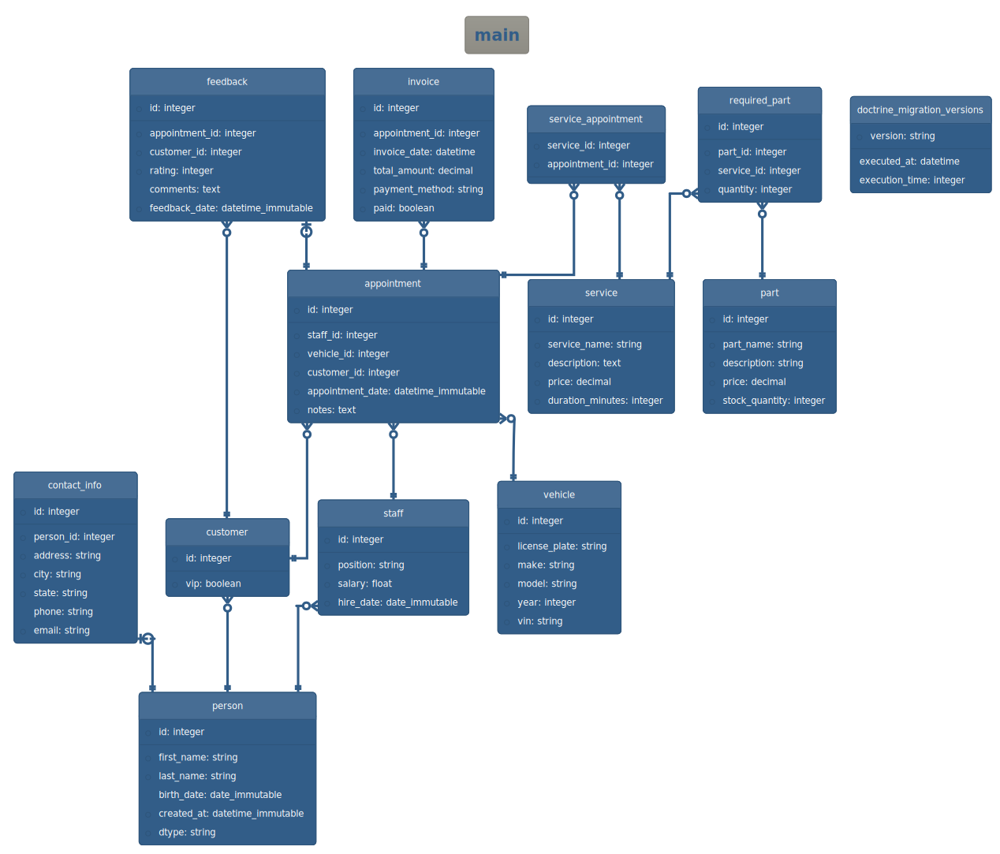
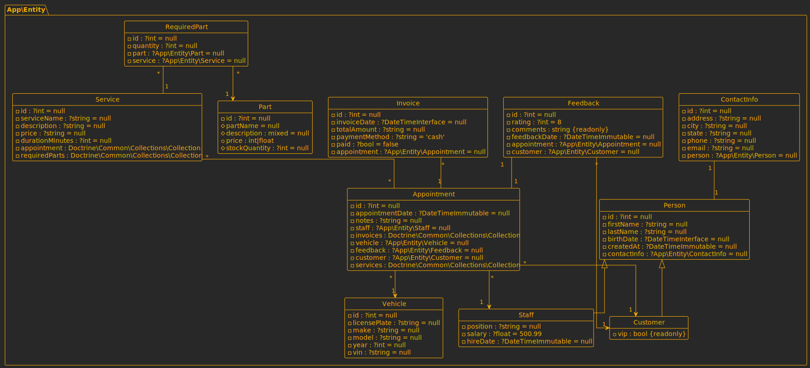

## How to configure the bundle

You have to ways to configure _DoctrineDiagramBundle_.

1. Using a configuration file `config/packages/doctrine_diagram.yaml`.
2. Using command's options.

!!! Info

    Command line options will always have priority over configuration file.

### Command's options

Use `help` command to see available options for `doctrine:diagram:er` and
`doctrine:diagram:class`.

```console
$ bin/console help doctrine:diagram:er
Description:
  Create an Entity-Relationship diagram.

Usage:
  doctrine:diagram:er [options]

Options:
      --filename=FILENAME      Destination file name.
      --format=FORMAT          Diagram format (svg, png or puml).
      --size=SIZE              Diagram size (mini, midi or maxi).
      --converter=CONVERTER    Which strategy will be used to convert puml to another format (auto, jar or server).
      --server=SERVER          PlantUML server URL, used to convert puml diagrams to svg or png.
      --jar=JAR                Path to plantuml.jar, used to convert puml diagrams to svg or png.
      --connection=CONNECTION  Doctrine connection to use.
      --theme=THEME            Theme name, this will change colors and style.
      --include=INCLUDE        Name of the table to include in the diagram. (multiple values allowed)
      --exclude=EXCLUDE        Name of the table to exclude from the diagram. (multiple values allowed)
```

```console
$ bin/console help doctrine:diagram:class
Description:
  Create a Class diagram.

Usage:
  doctrine:diagram:class [options]

Options:
      --filename=FILENAME    Destination file name.
      --format=FORMAT        Diagram format (svg, png or puml).
      --size=SIZE            Diagram size (mini, midi or maxi).
      --converter=CONVERTER  Which strategy will be used to convert puml to another format (auto, jar or server).
      --server=SERVER        PlantUML server URL, used to convert puml diagrams to svg or png.
      --jar=JAR              Path to plantuml.jar, used to convert puml diagrams to svg or png.
      --em=EM                Entity Manager to use.
      --theme=THEME          Theme name, this will change colors and style.
      --include=INCLUDE      Name of the class to include in the diagram. (multiple values allowed)
      --exclude=EXCLUDE      Name of the class to exclude from the diagram. (multiple values allowed)
```

!!! Tip

    The commands `doctrine:diagram:er` and `doctrine:diagram:class` share 
    almost all the same options, the only difference is that 
    `doctrine:diagram:er` uses the `--connection` option, while 
    `doctrine:diagram:class` uses `--em`.

### Configuration file

Configuration file is located at `config/packages/doctrine_diagram.yaml`, this
is a full configuration example:

```yaml
doctrine_diagram:
    er:
        filename: '%kernel.project_dir%/er'
        size: midi
        theme: crt-amber
        connection: ~
        include:
            - table1
            - table2
        exclude:
            - table3
            - table4
    class:
        filename: '%kernel.project_dir%/class'
        size: mini
        theme: plain
        em: ~
        include:
            - App\Entity\Client
            - App\Entity\Feeback
        exclude:
            - App\Entity\User
            - App\Entity\CreditCard
    convert:
        format: svg
        converter: auto
        jar: /usr/bin/plantuml
        server: 'http://www.plantuml.com/plantuml'

```

Use the following commands to see your current configuration and all available
options:

```console
bin/console debug:config doctrine_diagram
bin/console config:dump-reference doctrine_diagram
```

## Specify diagram name

By default, the diagram filename is `er.svg` for Entity-Relationship diagrams
and `class.svg` for Class diagrams.
The file extension is added automatically based on the chosen format.

You can modify the filename with the `--filename` option:

```console
bin/console doctrine:diagram:er --filename=customers
bin/console doctrine:diagram:class --filename=employees
```

Alternatively, specify the filename in `config/packages/doctrine_diagram.yaml`:

```yaml
doctrine_diagram:
    er:
        filename: '%kernel.project_dir%/customers'
    class:
        filename: '%kernel.project_dir%/employees'
```

!!! TIP

    You don't need to explicitly set filename extension, it's autmatically 
    added according to selected diagram format.

## Set diagram size

You can generate diagrams in different sizes:

* **mini**: Display only _table_ or _class_ names.
* **midi**: Include _tables_ and _columns_ for Entity-Relationship diagrams and
  _classes_ and _properties_ for Class diagrams.
* **maxi**: Show table names, columns, and views for Entity-Relationship
  diagrams. And _classes_, _properties_, and _methods_ for Class diagrams.

Adjust the diagram size using the `--size` option:

```console
bin/console doctrine:diagram:er --size=mini
bin/console doctrine:diagram:class --size=midi
```

Alternatively, set the diagram size in the config file:

```yaml
doctrine_diagram:
    er:
        size: mini
    class:
        size: midi
```

## Customizing themes

Use themes to change the look of your diagrams.

From the terminal, you can set the theme using `--theme` option.

```console
bin/console doctrine:diagram:er --theme=sandstone
bin/console doctrine:diagram:class --theme=crt-amber
```

Alternatively, set the diagram size in the config file:

```yaml
doctrine_diagram:
    er:
        theme: sandstone
    class:
        theme: crt-amber
```

This is a complete list of available themes:


Please note that all themes might not be available in your system since themes
are dependent of the version of PlantUML you have installed.

_sandstone_ theme:



_crt-amber_ theme:



## Filtering tables and classes

You can customize the elements appearing in a diagram using `--include` and
`--exclude` options.

To select specific elements to appear (tables from the ER diagram and classes
from Class diagram), use the `--include` option. On the other hand use the
`--exclude` option to remove elements.

Internally, these two filters are applied in order, first the `--include` option
and then the `--exclude` option is used on the tables specified by the
`--include` option. When the `--include` options is omitted, all the tables in
the database are going to be used.

Entity-relationship diagram examples:

```console
# Display three tables in the diagram
bin/console doctrine:diagram:er --include=table1 --include=table2 --include=table3

# Hide 'secrets' table
bin/console doctrine:diagram:er --exclude=secrets
```

Class diagram examples:

```console
# Print all entities but remove 'App\Entity\CreditCard' from the diagram
bin/console doctrine:diagram:class --exclude=App\\Entity\\CreditCard
```

!!! TIP

    Note how, in the terminal, we had to escape the backslash character.

Explicitly typing the elements one by one, can be extremely long. This is where
**wildcards** are very useful:

* Use the `?` wildcard to represent a single character.
* Use the `*` wildcard to represent multiple characters.

Entity-relationship diagram examples:

```console
# Display only accounting tables from years 20XX 
bin/console doctrine:diagram:er --include=accounting_20??

# Remove all tables starting with 'classified'
bin/console doctrine:diagram:er --exclude=classified*
```

Class diagram examples:

```console
# Only use entities from Acme and App namespaces
bin/console doctrine:diagram:class --include=Acme\\* --include=App\\*

# Remove all entities from Lexik vendor
bin/console doctrine:diagram:class --exclude=Lexik\\Bundle\\*
```

In the config file, use the `include` and `exclude` in the same way. 

```yaml
doctrine_diagram:
    er:
        include:
            - user_*
            - exams_20??
        exclude:
            - user_passwords
            - user_secrets
    class:
        include:
            - App\Entity\*
            - Lexik\*
        exclude:
            - App\Entity\CreditCard
```

!!! TIP

    Remember, when you omit the `include` key, all the tables/classes are used.

## Change the diagram format

Three formats are supported: `png`, `svg`, and `puml`.

You can set the format from the terminal using the `--format` option:

```console
bin/console doctrine:diagram:er --format=puml
bin/console doctrine:diagram:class --format=puml
```

Alternatively, you can set the format in
`config/packages/doctrine_diagram.yaml`:

```yaml
doctrine_diagram:
    convert:
        format: svg
```

!!! TIP

    If you encounter difficulties generating your diagram, use the `puml` 
    format as it doesn't require PlantUML.

## Specifying how to convert PlantUML diagrams

When generating diagrams, _DoctrineDiagramBundle_ will always generate
diagrams in `puml` format first. If the requested format is `puml`, then the
diagram will be returned as is.
Otherwise, if the requested format is `png` or `svg`, you will need to
configure a "`converter`".

PlantUML can be used in two possible ways:

1. As a local `plantuml.jar` file.
2. As a remote PlantUML server.

Use the following options to set the `jar` file.

```console
bin/console doctrine:diagram:er --converter=jar --jar=/usr/share/plantuml/plantuml.jar
```

You can achieve the same using the configuration file:

```yaml
doctrine_diagram:
    convert:
        converter: jar
        jar: /usr/share/plantuml/plantuml.jar 
```

The other alternative to generate images is to use a remote PlantUML server:

```console
bin/console doctrine:diagram:er --converter=server --server=http://localhost:8080/plantuml
```

You can achieve the same using the configuration file:

```yaml
doctrine_diagram:
    convert:
        converter: server
        server: http://localhost:8080/plantuml 
```

The recommended configuration is `auto`, with this setting
_DoctrineDiagramBundle_ will search for `plantuml.jar` first , if
the jar file is not found then it will use a remote PlantUML server.

```console
bin/console doctrine:diagram:er --converter=auto
```

```yaml
doctrine_diagram:
    convert:
        converter: auto
```

Please read the dedicated page about [how to install PlantUML](./plantuml.md).
