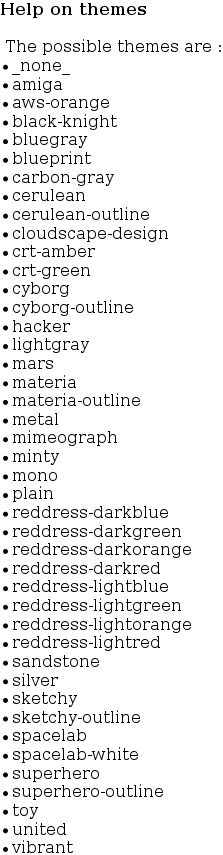

# Themes

You can change you the style of you diagrams using themes.

## Setting a theme

To set a theme use `--theme` option:

```console
bin/console doctrine:diagram --theme=amiga
```

Alternatively you can set the theme in `doctrine_diagram.yaml` configuration
file:

```yaml
doctrine_diagram:
  # ...
  theme: amiga
```

## Available themes

This is a complete list of available themes:



Please note that all themes might not be available in your system since themes
are dependant of the version of PlantUML you have installed.
