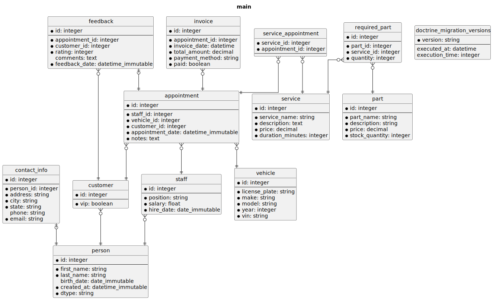
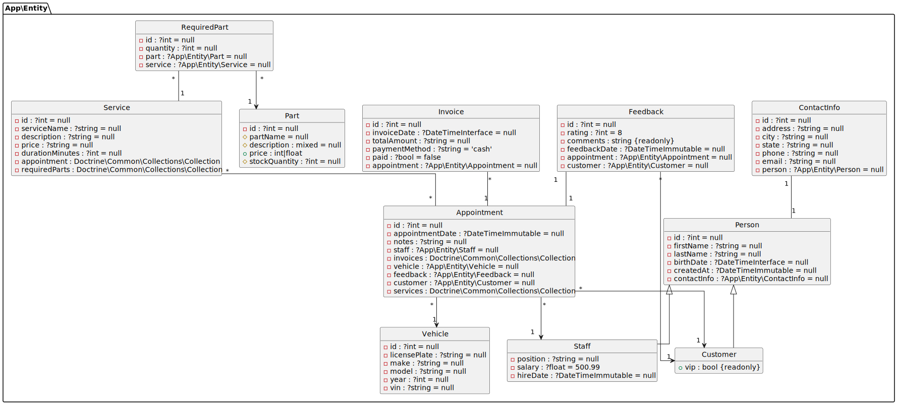

_DoctrineDiagramBundle_ provides two _Symfony_ commands to generate diagrams
from your database:

* `doctrine:diagram:er` - To generate Entity-Relationship diagrams.
* `doctrine:diagram:class` - To generate Class diagrams.

## Generating Entity-Relationship diagrams

An Entity-Relationship (ER) diagram visually represents the entities (such as
tables) in a database, their attributes (such as columns), and the relationships
between them.

Use the following command to generate Entity-Relationship diagrams:

```console
bin/console doctrine:diagram:er
```

You can also use the following shortcut:

```console
bin/console d:d:er
```

If you are using the default configuration, a file named `er.svg` will be
created at the root of your project.



If your application uses multiple databases, you can specify which DBAL
connection to use using the `--connection` option:

```console
bin/console doctrine:diagram:er --connection=employees
```

You can also set the DBAL connection in `doctrine_diagram.yaml`.

```yaml
doctrine_diagram:
    er:
        connection: employees
```

Set the connection to _null_, and the default connection will be used.

## Generating Class diagrams

A UML Class diagram visually represents the classes in your project, including
their properties (attributes), methods (operations), and the relationships
between them.

Use the following command to generate Class diagrams:

```console
bin/console doctrine:diagram:class
```

You can also use the following shortcut:

```console
bin/console d:d:class
```

!!! Info

    _DoctrineDiagramBundle_ will only use _Doctrine entities_ to generate the
    diagram. Additionally, only properties with the `ORM\Column` attribute are
    displayed, other class properties are ignored.

If you are using the default configuration, a file named `class.svg` will be
created at the root of your project.



If your application uses multiple databases, you can specify which Entity
Manager to use using the `--em` option:

```console
bin/console doctrine:diagram:class --em=customers
```

In `doctrine_diagram.yaml`:

```yaml
doctrine_diagram:
    class:
        em: customers
```

Set `em` to _null_, and the default Entity Manager will be used.

## How to pipe output

Use `php://stdout` as the destination file to redirect image to standard output.

For example:

```console
bin/console doctrine:diagram:er --filename="php://stdout" --format=puml | tee diagram.puml
```

## Known Issues

### Error: "Failed to open stream: HTTP request failed!"

This error occurs when you are trying to generate a diagram in SVG or PNG
formats, and you are using the public PlantUML server.

The problem is that the diagram you are trying to create is too large, and the
PlantUML server has limited diagram sizes to avoid abuse.

**Solution 1**

Use PlantUML locally instead of a web server. This is explained
in [Configuration](configuration.md) page.

**Solution 2**

Generate a diagram in PUML format. This diagram is generated locally and doesn't
require the PlantUML server. Then, use the `plantuml` executable locally to
convert the PUML diagram to the desired format.

```console
bin/console doctrine:diagram:er --format=puml
bin/console doctrine:diagram:class --format=puml
```

**Solution 3**

Do not use the public PlantUML
server; [use your own PlantUML server instead](./plantuml.md).

Then, access your server using the command option `--server`, or in the
`doctrine_diagram.yaml` file.

### Error 'Unknown column type "uuid" requested'

You encounter the following error when trying to generate a diagram:

> CRITICAL  [console] Error thrown while running command "doctrine:diagram".
> Message: "Unknown column type "uuid" requested. Any Doctrine type that you use
> has to be registered with \Doctrine\DBAL\Types\Type::addType().

To fix this error, add a custom type in the doctrine.yaml config file.
For example:

```yaml

doctrine:
    dbal:
        types:
            uuid: Symfony\Bridge\Doctrine\Types\UuidType
```

Source: [Registering custom Mapping Types](https://symfony.com/doc/current/doctrine/dbal.html#registering-custom-mapping-types).

### Error "Syntax Error"

When trying to generate a Diagram, you get the following error in the terminal:

```console
Error Output:
================
ERROR
7
Syntax Error?
Some diagram description contains errors
```

**Solution**

Use a newer version of PlantUML, older versions of PlantUML do not support
features like _themes_ and custom _namespace separators_.
